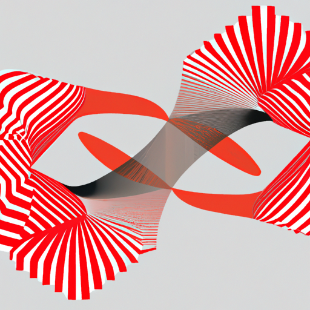
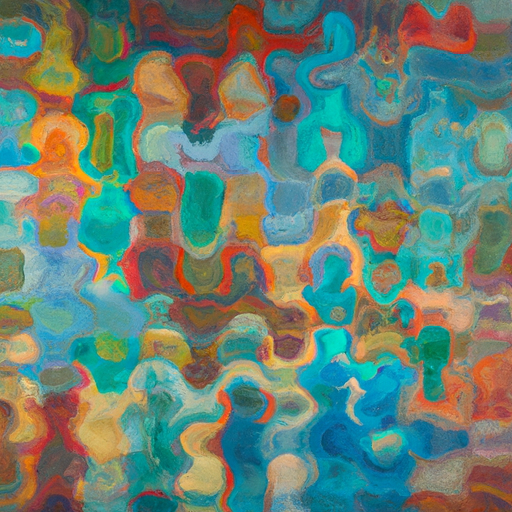
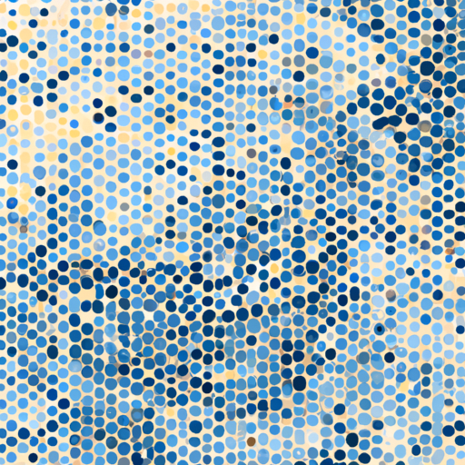

# noisyFineArt

# Noisy Art: Transforming Sounds into Visuals

**Noisy Art** is an experimental project aimed at transforming the everyday, natural sounds of life into visually compelling art. By analyzing features from audio recordings, the project bridges the auditory and visual domains, offering a fresh perspective on how sound can inspire creativity.

---

## Overview

This project processes natural, everyday noises (e.g., rain, whistling, old TV static) and extracts detailed acoustic features such as **tempo**, **frequency**, **onset density**, and **zero-crossing rate**. These features are mapped to artistic descriptors, which are then visualized through advanced AI tools like DALL-E.

---

## Key Features

- **Feature Extraction**  
  Utilizes Python libraries like `librosa` for analyzing acoustic properties:
  - Tempo
  - Spectral centroid (frequency)
  - Onset density (rhythmic activity)
  - Bandwidth and loudness  

- **Dynamic Feature Mapping**  
  A custom framework translates sound features into artistic interpretations:
  - Keywords such as *"broad and textured"* or *"focused and piercing"* reflect the sound's characteristics.
  - Artistic styles like *cubism* or *impressionism* emerge through mapping.

- **AI Integration**  
  Visual representations inspired by sound descriptors are generated using **DALL-E**.

- **Automation with Makefile**  
  Automates the workflow for extracting sound features, generating prompts, and invoking AI models.

- **Data Security with auto-env-encrypt.sh**  
  Secures environment variables (e.g., API keys) through automated encryption and decryption.

---

## Usage

### Requirements
- Docker and Docker Compose
- `gpg` for environment file encryption and decryption
- Python 3.x for database initialization

### Setup
1. **Clone the repository**:  
   ```bash
   git clone https://github.com/yourusername/noisyFineArt.git
   cd noisyFineArt
2. Prepare your environment:
   - Add your OpenAI API key to a .env file.
3. Encrypt the .env file using gpg
   ```bash
   # Run the script
    chmod +x auto-env-encrypt.sh
    ./auto-env-encrypt.sh
    
    # Manual encryption
    gpg --batch --yes --passphrase "your-passphrase" -c .env
   ```
4. decryption
   - manual
   ```bash
   gpg -d -o .env .env.gpg
   ```
   - with Makefile
   ```bash
   make decrypt-mama
   ```
   

   

## Example Workflow
Build the Docker container:

```bash
make build
```
Start the Docker container (initializes the database if needed):

```bash
make up
```
Upload an audio file to test the API:

```bash
curl -X POST -F "file=@example.wav" http://localhost:5000/upload
```
View the logs for any issues:

```bash
make logs
```
Stop and remove the container:

```bash
make down
```

Force cleanup of generated files and containers:
  ```bash
  make fclean
```


## Project Results Examples
  For more test results and examples, please refer to the [tested_srcs](tested_srcs/) directory in this repository. This directory contains detailed outputs for each sound file, including audio files, prompts, and generated images.

### Input Sound Files
- [Old TV Sound](https://coisu.github.io/noisyFineArt/1/)
- [Rain Sound](https://coisu.github.io/noisyFineArt/2/)
- [Beating Egg Sound](https://coisu.github.io/noisyFineArt/3/)


### Output Image
#### Old TV
- Extracted Prompts:
  ```
  "An abstract art piece inspired by balanced distribution, steady rhythm, focused and linear, gentle and smooth, experimental"
  ```
  


#### Rain
- Extracted Prompts:
```
  "An abstract art piece inspired by balanced distribution, steady rhythm, neutral tone, crisp and vibrant, impressionism"
```



#### Beating Egg
- Extracted Prompts:
```
  "An abstract art piece inspired by balanced distribution, intense and rhythmic, focused and linear, gentle and smooth, neo-impressionism Pointillism"
```




---

## Future Work

This project is continually evolving. Planned improvements include:

1. **Refining feature extraction** to better reflect the nuances of natural, everyday sounds.
2. **Direct visualization** of audio features without relying solely on AI image generators.
3. **Improved multi-feature mappings** to enhance artistic interpretations.
4. **Broader testing dataset**, incorporating more diverse natural sounds.

---
