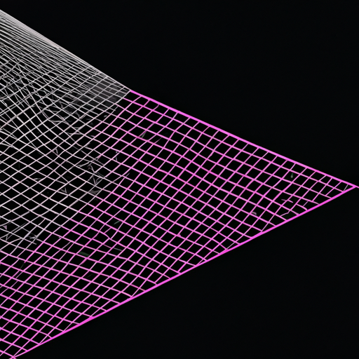

# noisyFineArt

# Noisy Art: Transforming Sounds into Visuals

**Noisy Art** is an experimental project aimed at transforming the everyday, natural sounds of life into visually compelling art. By analyzing features from audio recordings, the project bridges the auditory and visual domains, offering a fresh perspective on how sound can inspire creativity.

---

## Overview

This project processes natural, everyday noises (e.g., rain, whistling, old TV static) and extracts detailed acoustic features such as **tempo**, **frequency**, **onset density**, and **zero-crossing rate**. These features are mapped to artistic descriptors, which are then visualized through advanced AI tools like DALL-E.

---

## Key Features

- **Feature Extraction**  
  Utilizes Python libraries like `librosa` for analyzing acoustic properties:
  - Tempo
  - Spectral centroid (frequency)
  - Onset density (rhythmic activity)
  - Bandwidth
  - Loudness
  - Zero crossing rate(ZCR)

- **Dynamic Feature Mapping**  
  A custom framework translates sound features into artistic interpretations:
  - Keywords such as *"broad and textured"* or *"focused and piercing"* reflect the sound's characteristics.
  - Artistic styles like *cubism* or *impressionism* emerge through mapping.

- **AI Integration**  
  Visual representations inspired by sound descriptors are generated using **DALL-E**.

- **Automation with Makefile**  
  Automates the workflow for extracting sound features, generating prompts, and invoking AI models.

- **Data Security with auto-env-encrypt.sh**  
  Secures environment variables (e.g., API keys) through automated encryption and decryption.

---

## Usage

### Requirements
- Docker and Docker Compose
- `gpg` for environment file encryption and decryption
- Python 3.x for database initialization

### Setup
1. **Clone the repository**:  
   ```bash
   git clone https://github.com/yourusername/noisyFineArt.git
   cd noisyFineArt
2. Prepare your environment:
   - Add your OpenAI API key to a .env file.
3. Encrypt the .env file using gpg
   ```bash
   # Run the script
    chmod +x auto-env-encrypt.sh
    ./auto-env-encrypt.sh
    
    # Manual encryption
    gpg --batch --yes --passphrase "your-passphrase" -c .env
   ```
4. decryption
   - manual
   ```bash
   gpg -d -o .env .env.gpg
   ```
   - with Makefile
   ```bash
   make decrypt-mama
   ```
   

   

## Example Workflow
Build the Docker container:

```bash
make build
```
Start the Docker container (initializes the database if needed):

```bash
make up
```
Upload an audio file to test the API:

```bash
curl -X POST -F "file=@example.wav" http://localhost:5000/upload
```
View the logs for any issues:

```bash
make logs
```
Stop and remove the container:

```bash
make down
```

Force cleanup of generated files and containers:
  ```bash
  make fclean
```


## Project Results Examples
  For more test results and examples, please refer to the [tested_srcs](tested_srcs/) directory in this repository. This directory contains detailed outputs for each sound file, including audio files, prompts, and generated images.

### Input Sound Files
- [Old TV Sound](https://coisu.github.io/noisyFineArt/sounds/1/)
- [Rain Sound](https://coisu.github.io/noisyFineArt/sounds/2/)
- [Beating Egg Sound](https://coisu.github.io/noisyFineArt/sounds/3/)


### Output Image
#### Old TV
- Extracted Prompts:
  ```
  "An abstract art piece inspired by balanced distribution, steady rhythm, focused and linear, gentle and smooth, experimental"
  ```
  


#### Rain
- Extracted Prompts:
```
  "An abstract art piece inspired by balanced distribution, steady rhythm, neutral tone, crisp and vibrant, impressionism"
```


#### Beating Egg
- Extracted Prompts:
```
  "An abstract art piece inspired by balanced distribution, intense and rhythmic, focused and linear, gentle and smooth, neo-impressionism Pointillism"
```


---
# Future Improvements and Expansion Ideas

This project is a work in progress, with several planned improvements and exciting expansion opportunities. Below is a summary of potential developments:

## Improvement Areas

1. **Refining the Keyword Extraction Logic**  
   - Enhance the keyword generation algorithm to better capture unique sound characteristics.  
   - Reduce redundancy and improve the diversity of generated keywords.  
   - Reflect the nuances of natural, everyday sounds rather than focusing solely on music files.  

2. **Developing an Independent Visualization Logic**  (detail below)
   - Move away from reliance on external AI APIs by creating a custom visualization algorithm.  
   - Strengthen the project’s identity by using data-driven pattern generation.  
   - Implement direct visualization of audio features to connect auditory elements with visual outputs seamlessly.  

3. **Mobile App Development**  (detail below)
   - Build a new platform to capture moments in a unique way, integrating real-time sound analysis with interactive and shareable visuals.  
   - See details in the Mobile App Development section below.  

4. **Adjusting Feature Ranges**  
   - Recalibrate thresholds for feature values (e.g., bandwidth, onset density) to better align with natural and everyday soundscapes.  
   - Allow users to define custom ranges for flexible testing and creativity.  

5. **Integrating Diverse Datasets**  
   - Expand the range of tested sounds to include urban noise, natural environments, and industrial sounds.  
   - Provide users with richer, more diverse experiences through a broader dataset.  

---

## Independent Visualization Algorithm

If developing a custom visualization algorithm, some potential approaches might include:

1. **Data-Driven Graphics Generation**  
   - Use mathematical transformations of audio features (e.g., frequency, amplitude, and tempo) to generate patterns, colors, and textures.  
   - Example: Map high-frequency sounds to sharp geometric shapes, while low-frequency sounds create softer, rounded visuals.   

2. **Layered Mapping**  
   - Develop multi-layered visual compositions where each audio feature contributes to distinct elements of the art.  
   - Example: Use tempo to guide structural layouts, loudness for color intensity, and frequency for fine details.  

3. **User-Tunable Visualization**  
   - Allow users to experiment with different styles and mapping rules.  
   - Example: Provide an interface for adjusting how audio features correspond to visual elements.

By leveraging such techniques, a standalone visualization solution would not only replace AI generators but also offer a distinct and personalized creative tool tailored to this project.

---

## Mobile App Development: A Social Network for Sound and Visuals  
### Key Features:  
- **Real-Time Sound Visualization**  
  - Users can record and visualize their surrounding sounds, generating abstract art pieces instantly.  

- **Interactive Media Experience**  
  - Posts display sound-generated visuals paired with the original audio.  
  - Interactive gestures like clicks or swipes reveal the original video or related content tied to the sound.  

- **Short Moment Captions**  
  - Users can add concise captions (under 100 characters) to each post, quickly describing or personalizing the moment.  

- **Social Network Integration**  
  - Create a global platform where users can share their sound-based artwork.  
  - Follow friends, discover unique moments from others, and curate collections of visually enhanced everyday sounds.  

### Target Audience:  
- **Travel Enthusiasts:** Capture and share unique soundscapes from various destinations.  
- **Creative Minds:** Artists and designers seeking fresh inspiration through sound-driven visuals.  
- **Casual Users:** Anyone interested in turning mundane moments into artistic expressions.  

### Example Use Cases:  
- Document the essence of a bustling market or serene park in a visually creative format.  
- Share unique sound-art moments with friends on a platform that values auditory and visual experiences equally.  
- Explore a feed filled with abstract and original art, fostering creative connections through sound.  

