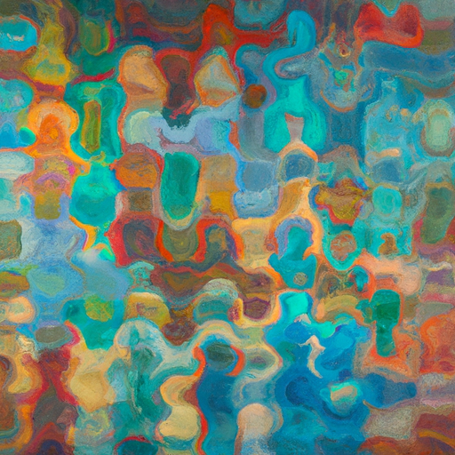

# Noisy Art: Test Results

This directory contains the results of the **Noisy Art** project, where natural sounds from daily life are analyzed and transformed into visual art using artificial intelligence. Each sound file has been tested three times, producing unique feature analyses and visual outputs.

---

## Directory Structure

Each result file is named using a **6-digit numeric format**, corresponding to the test sequence. Files are grouped in threes, representing the three test results for a single audio file.

### **Test File Mapping**

| File Name        | Test IDs        | Description                                        |
|------------------|----------------|----------------------------------------------------|
| `rain.mp3`       | `000001-000003` | Captures the dynamic patterns of rainfall.         |
| `whistle.mp3`    | `000004-000006` | Reflects tonal variations of whistling.            |
| `stairs.mp3`     | `000007-000009` | Rhythmic patterns of heavy footsteps on stairs.    |
| `atm.mp3`        | `000010-000012` | Mechanical and ambient ATM sounds.                 |
| `beat_egg.mp3`   | `000013-000015` | Irregular, repetitive sound of beating eggs.       |
| `cafe_noise.mp3` | `000016-000018` | Ambient café noise with overlapping chatter.       |
| `fire.mp3`       | `000019-000021` | Crackling and flickering fire sounds.              |
| `fireworks.mp3`  | `000022-000024` | Bursts of fireworks.                               |
| `old_tv.mp3`     | `000025-000027` | Vintage static noise resembling an old television. |

---

## How to Use

1. **Navigate** to the appropriate directory using the **Test IDs** listed above.
2. Each test result includes:
   - **Extracted audio features** (tempo, frequency, bandwidth, etc.).
   - **AI-generated visuals** derived from these features.

### Example

- `000001`, `000002`, and `000003` are the three test results for `rain.mp3`.
- Each result contains:
  - **`noise.wav`**: The processed sound used in testing.
  - **`prompt.txt`**: The generated prompt describing the visual representation.
  - **`result_image.png`**: The AI-generated artwork based on the audio features.

## Results

#### Rain
- [Rain Sound](https://coisu.github.io/noisyFineArt/sounds/2/)
- Extracted Prompts:
```
  "An abstract art piece inspired by balanced distribution, steady rhythm, neutral tone, crisp and vibrant, impressionism"
```

<div style="display: flex; justify-content: space-around;">
  
  
</div>

#### Whistle
- [Whistle Sound](https://coisu.github.io/noisyFineArt/sounds/4/)
- Extracted Prompts:
```
  "An abstract art piece inspired by balanced distribution, steady rhythm, focused and linear, gentle and smooth, experimental"
```
<div style="display: flex; justify-content: space-around;">
  
  
</div>

#### Stairs
- [Stairs Sound](https://coisu.github.io/noisyFineArt/sounds/5/)
- Extracted Prompts:
```
  "An abstract art piece inspired by balanced distribution, slow yet textured, soft and serene, heavy and full-bodied, experimental"
```

<div style="display: flex; justify-content: space-around;">
  
  
</div>

#### ATM
- [ATM Sound](https://coisu.github.io/noisyFineArt/sounds/6/)
- Extracted Prompts:
```
  "An abstract art piece inspired by balanced distribution, fast but sparse, soft and serene, gentle and smooth, experimental"
```

<div style="display: flex; justify-content: space-around;">
  
  
</div>


#### Beating Egg
- [Beating Egg Sound](https://coisu.github.io/noisyFineArt/sounds/3/)
- Extracted Prompts:
```
  "An abstract art piece inspired by balanced distribution, intense and rhythmic, focused and linear, gentle and smooth, neo-impressionism Pointillism"
```

<div style="display: flex; justify-content: space-around;">
  
  
</div>

#### Cafe
- [Cafe Sound](https://coisu.github.io/noisyFineArt/sounds/7/)
- Extracted Prompts:
```
  "An abstract art piece inspired by broad and textured, steady rhythm, soft and serene, evenly distributed, gentle and smooth, post-impressionism"
```

<div style="display: flex; justify-content: space-around;">
  
  
</div>


#### Old TV
- [Old TV Sound](https://coisu.github.io/noisyFineArt/sounds/1/)
- Extracted Prompts:
  ```
  "An abstract art piece inspired by balanced distribution, steady rhythm, focused and linear, gentle and smooth, experimental"
  ```
  
<div style="display: flex; justify-content: space-around;">
  
  
</div>


